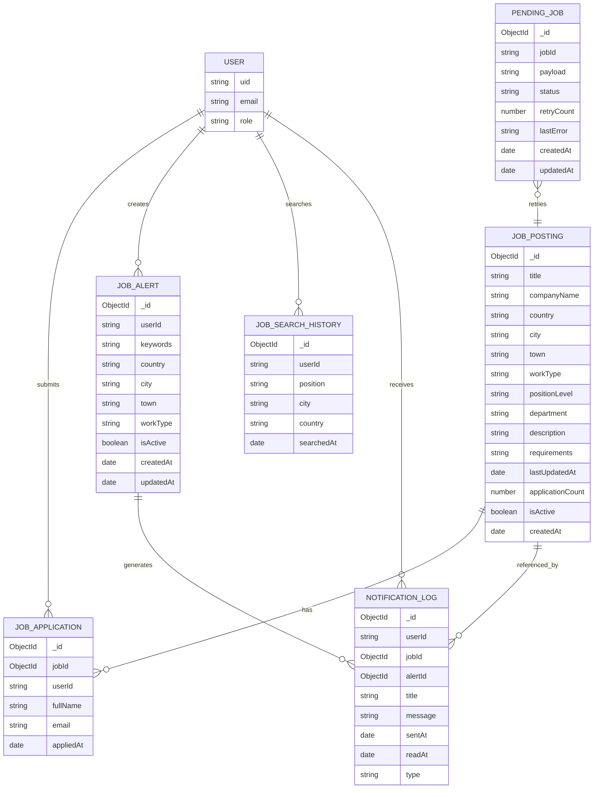

# Silasly Job Platform

Silasly is a job search web application with a React frontend and a set of Node.js backend services behind an API Gateway. The application supports job search, job details, applications, admin job management, saved search history, job alerts, notifications, and a small rule-based assistant for job discovery.

## Live Azure Deployment

- Frontend: `https://silasly-final-frontend.azurewebsites.net`
- API Gateway: `https://silasly-final-api.azurewebsites.net/api/v1`
- Job Posting Service: `https://silasly-final-jobs.azurewebsites.net`
- Job Search Service: `https://silasly-final-job-search.azurewebsites.net`
- Notification Service: `https://silasly-final-notification.azurewebsites.net`
- Agent Service: `https://silasly-final-agent.azurewebsites.net`

The frontend is configured to call only the API Gateway in production. Browser network requests should use the API Gateway base URL rather than calling internal services directly.

## Demo Accounts

The following accounts are available for review:

| Role | Email |
| --- | --- |
| User | `sila@is.com` |
| Admin | `sila@admin.com` |

The demo password is shared separately for security reasons.

## Project Description

The project is built around a job platform scenario. Users can search current job postings, filter by position and city, view job detail pages, apply to jobs, create job alerts, and receive notifications when new jobs match their saved criteria. Admin or company users can create, update, and deactivate job postings from the management page.

## Design and Architecture

All browser-facing API traffic goes through the API Gateway. The gateway exposes the shared `/api/v1` API surface and routes requests to separately deployed backend services.

- Frontend: React and Vite single-page application.
- API Gateway: routes public API requests and checks service health.
- Job Posting Service: owns job postings, companies, applications, job detail cache, and job-created events.
- Job Search Service: stores user search history in a separate collection/database.
- Notification Service: owns job alerts, notification logs, pending jobs, scheduled notification tasks, and queue consumption.
- Agent Service: parses simple job search messages and uses the job posting API to return matching jobs.

Supporting services:

- MongoDB Atlas stores application data.
- Redis is used as a distributed cache for job detail responses.
- RabbitMQ is used for job-created notification flow.
- Firebase Authentication provides user identity and role claims.

## Main API Endpoints

All browser requests are routed through the API Gateway base URL:

`https://silasly-final-api.azurewebsites.net/api/v1`

| Use case | Method and path | Auth |
| --- | --- | --- |
| Service health | `GET /health/services` | Public |
| List and filter jobs | `GET /jobs?page=1&limit=5&position=ios&city=İstanbul` | Public |
| Job detail | `GET /jobs/:id` | Public |
| Related jobs | `GET /jobs/:id/related` | Public |
| Position autocomplete | `GET /jobs/autocomplete/positions?search=ios` | Public |
| City autocomplete | `GET /jobs/autocomplete/cities?search=ist` | Public |
| Create job | `POST /jobs` | Admin/company |
| Update job | `PUT /jobs/:id` | Admin/company |
| Deactivate job | `DELETE /jobs/:id` | Admin/company |
| Apply to job | `POST /jobs/:id/apply` | User |
| Application status | `GET /jobs/:id/application-status` | User |
| List applications | `GET /applications?page=1&limit=20` | Admin/company |
| Save search history | `POST /search-history` | User |
| List user search history | `GET /search-history/:userId` | User/admin |
| Create job alert | `POST /alerts` | User |
| List user alerts | `GET /alerts/:userId` | User/admin |
| Update alert | `PUT /alerts/:id` | User/admin |
| Delete alert | `DELETE /alerts/:id` | User/admin |
| List notifications | `GET /notifications/:userId?page=1&limit=10` | User/admin |
| Unread notification count | `GET /notifications/:userId/unread-count` | User/admin |
| Mark notifications read | `PATCH /notifications/:userId/read` | User/admin |
| Process job alert task | `POST /tasks/process-job-alerts` | Scheduler/internal operation |
| Process related search task | `POST /tasks/process-related-search-notifications` | Scheduler/internal operation |
| Agent message | `POST /agent/message` | Public |

## Requirement Checklist

### Home Page

- Position and city search are supported.
- Position and city inputs support autocomplete.
- The home page can use a preferred user city when available.
- The page shows current job postings and falls back to broader results if a preferred-city search has too few matches.
- Recent searches are shown under `Son Aramalarım` for authenticated users.
- The login link is shown only when the user is not authenticated.

### Search Results

- Results can be filtered by position, city, town, and work type.
- Active filters are shown above the result list.
- Each active filter can be removed individually.
- Results support pagination through the `page` and `limit` query parameters.

### Job Detail and Application

- Job detail includes title, company, location, work type, last updated date, application count, description, and requirements.
- Related postings are shown on the job detail page.
- Authenticated users can apply from the detail page.
- Unauthenticated users are redirected to the login page before applying.
- Admin/company users can add, update, and deactivate job postings.

### Notification

- New job postings are published to RabbitMQ.
- The notification service consumes job-created messages and stores pending jobs for retry when needed.
- Job alerts are matched against new postings by keywords, country, city, town, and work type.
- Search history is stored separately from the job posting data.
- A scheduled task sends related job notifications based on recent search history.
- Notification records can be listed and marked as read through REST endpoints.

### Agent

- The chat window is available from the main application screen.
- The agent searches jobs through the existing REST APIs.
- The agent can return job cards and guide users to detail/application flows.
- The agent is rule-based by design; the assignment does not require external model integration.

## Data Models

### JobPosting

- `_id`
- `title`
- `companyName`
- `country`
- `city`
- `town`
- `workType`
- `positionLevel`
- `department`
- `description`
- `requirements`
- `lastUpdatedAt`
- `applicationCount`
- `isActive`
- `createdAt`

### JobApplication

- `_id`
- `jobId`
- `userId`
- `fullName`
- `email`
- `appliedAt`

Relationship: one `JobPosting` can have many `JobApplication` records.

### JobAlert

- `_id`
- `userId`
- `keywords`
- `country`
- `city`
- `town`
- `workType`
- `isActive`
- `createdAt`
- `updatedAt`

Relationship: one user can have many `JobAlert` records.

### NotificationLog

- `_id`
- `userId`
- `jobId`
- `alertId`
- `title`
- `message`
- `sentAt`
- `readAt`
- `type`

Relationship: notifications are connected to a user, a job, and an alert/search source.

### JobSearchHistory

- `_id`
- `userId`
- `position`
- `city`
- `country`
- `searchedAt`

Relationship: one user can have many search history records.

### PendingJob

- `_id`
- `jobId`
- `payload`
- `status`
- `retryCount`
- `lastError`
- `createdAt`
- `updatedAt`

Relationship: pending jobs are used by the notification service to retry alert processing.

## Tech Stack

- React
- Vite
- Node.js
- Express
- MongoDB Atlas
- Redis
- RabbitMQ
- Firebase Authentication
- Azure App Service

## Environment Variables

Each service uses environment variables instead of hardcoded production values. Example files are included with placeholder values only.

### Frontend

- `VITE_API_BASE_URL`: API Gateway URL ending with `/api/v1`
- `VITE_FIREBASE_WEB_API_KEY`: Firebase Web API key for email/password authentication

### API Gateway

- `PORT`
- `FRONTEND_ORIGIN`
- `FIREBASE_PROJECT_ID`
- `FIREBASE_CLIENT_EMAIL`
- `FIREBASE_PRIVATE_KEY`
- `JOB_SEARCH_SERVICE_URL`
- `JOB_POSTING_SERVICE_URL`
- `NOTIFICATION_SERVICE_URL`
- `AI_AGENT_SERVICE_URL`

### Job Posting Service

- `PORT`
- `MONGODB_URI`
- `REDIS_URL`
- `RABBITMQ_URL`
- `NOTIFICATION_SERVICE_URL`
- `FIREBASE_PROJECT_ID`
- `FIREBASE_CLIENT_EMAIL`
- `FIREBASE_PRIVATE_KEY`
- `INTERNAL_SERVICE_KEY`
- `MONGODB_RETRY_INTERVAL_MS`
- `MONGODB_SERVER_SELECTION_TIMEOUT_MS`

### Job Search Service

- `PORT`
- `MONGODB_URI`
- `JOB_SEARCH_HISTORY_MONGODB_URI`
- `FIREBASE_PROJECT_ID`
- `FIREBASE_CLIENT_EMAIL`
- `FIREBASE_PRIVATE_KEY`
- `INTERNAL_SERVICE_KEY`

### Notification Service

- `PORT`
- `MONGODB_URI`
- `REDIS_URL`
- `RABBITMQ_URL`
- `FIREBASE_PROJECT_ID`
- `FIREBASE_CLIENT_EMAIL`
- `FIREBASE_PRIVATE_KEY`
- `JOB_SEARCH_SERVICE_URL`
- `JOB_POSTING_SERVICE_URL`
- `INTERNAL_SERVICE_KEY`

### Agent Service

- `PORT`
- `MONGODB_URI`
- `REDIS_URL`
- `RABBITMQ_URL`
- `FIREBASE_PROJECT_ID`
- `FIREBASE_CLIENT_EMAIL`
- `FIREBASE_PRIVATE_KEY`
- `JOB_POSTING_SERVICE_URL`


## ER Diagram




## Local Run Instructions

Install dependencies from the project root:

```bash
npm install
```

Create local environment files from the examples and fill in local or cloud service values:

```bash
cp apps/frontend/.env.example apps/frontend/.env
cp services/api-gateway/.env.example services/api-gateway/.env
cp services/job-posting-service/.env.example services/job-posting-service/.env
cp services/job-search-service/.env.example services/job-search-service/.env
cp services/notification-service/.env.example services/notification-service/.env
cp services/ai-agent-service/.env.example services/ai-agent-service/.env
```

Run each service in a separate terminal:

```bash
npm run dev:api-gateway
npm run dev:job-posting
npm run dev:job-search
npm run dev:notification
npm run dev:ai-agent
npm run dev:frontend
```

Default local ports:

- Frontend: `5173`
- API Gateway: `3000`
- Job Search Service: `3001`
- Notification Service: `3002`
- Agent Service: `3003`
- Job Posting Service: `3004`

## Build and Validation

Frontend production build:

```bash
npm run build -w apps/frontend
```

Backend services:

```bash
npm start -w services/api-gateway
npm start -w services/job-posting-service
npm start -w services/job-search-service
npm start -w services/notification-service
npm start -w services/ai-agent-service
```

Health checks:

```bash
curl https://silasly-final-api.azurewebsites.net/api/v1/health/services
curl https://silasly-final-api.azurewebsites.net/api/v1/jobs?page=1
```

## Deployment Notes

- The frontend build must receive `VITE_API_BASE_URL=https://silasly-final-api.azurewebsites.net/api/v1`.
- Backend service URLs in the API Gateway must point to the deployed service URLs.
- The frontend should not be configured with localhost URLs for production.
- MongoDB Atlas network access must allow the Azure App Service outbound IP addresses.
- Firebase service account values should be stored only in Azure App Service configuration.
- Redis and RabbitMQ connection strings should be stored only in environment variables.
- Job alert processing can run from the notification service scheduler or by calling task endpoints through the API Gateway.

## Assumptions

- Turkey is the default country for job search and alert flows.
- City selection is focused on Turkish cities.
- Notification delivery is represented as records in `NotificationLog`.
- Admin/company permissions are controlled through Firebase custom claims.
- Job deletion is implemented as deactivation so previous applications and references remain consistent.
- The assistant is rule-based and uses the existing job posting API.

## Issues Encountered

- MongoDB Atlas initially rejected Azure App Service connections until the App Service outbound IP addresses were added to the Atlas access list.
- A production service URL mismatch caused the gateway and related services to call an older job posting endpoint. The Azure environment variables were updated so all production calls use the active job posting service.
- Notification and agent services needed restarts after environment variable changes so they could reconnect with the updated configuration.
- Frontend production configuration was checked to confirm that browser requests use the API Gateway instead of localhost or internal service URLs.
